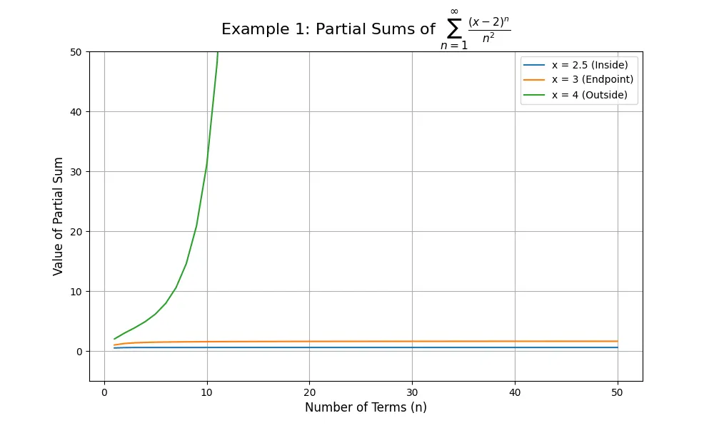
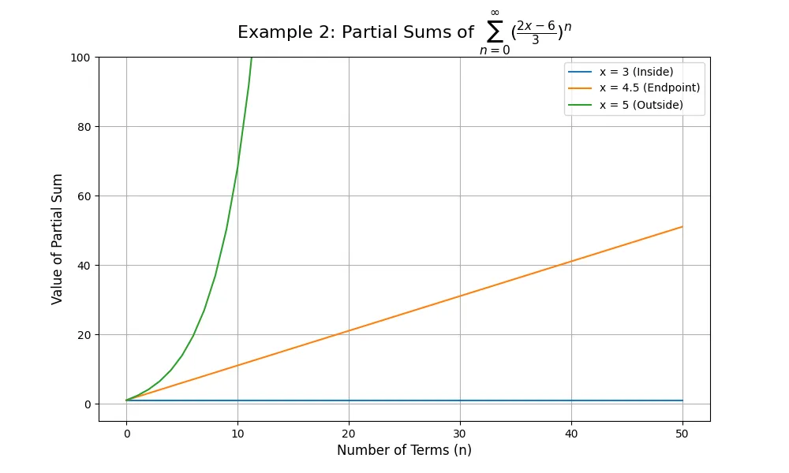

## Sequences

A **sequence of real numbers** is a function $a: \mathbb{N} \to \mathbb{R}$, where $\mathbb{N}$ is the set of natural numbers and $\mathbb{R}$ is the set of real numbers. A sequence is typically denoted by $\{a_n\}_{n=1}^{\infty}$ or simply $(a_n)$.

* The value $a_n$ is called the $n^{th}$ or the **general term**.
* The subscript $n$ is called the **index**.

### Definition: Convergent and Divergent Sequences

A sequence $(a_n)$ is **convergent** if its limit exists and is finite as $n$ approaches infinity. Mathematically:

$$\lim_{n \to \infty} a_n = L \quad (\text{where L is a finite real number})$$

Otherwise, the sequence is **divergent**. This occurs if:

* The limit does not exist ($\lim_{n \to \infty} a_n$ DNE).
* The limit is positive or negative infinity ($\lim_{n \to \infty} a_n = \pm \infty$).

### Example: Testing a Sequence for Convergence

Let's consider the sequence defined by the general term:

$$a_n = \frac{n}{n^2 + 1}$$

By substituting values for $n=1, 2, 3, \dots$, we find the first few terms:

* $a_1 = \frac{1}{1^2 + 1} = \frac{1}{2}$
* $a_2 = \frac{2}{2^2 + 1} = \frac{2}{5}$
* $a_3 = \frac{3}{3^2 + 1} = \frac{3}{10}$

The sequence can be written as:

$$(a_n) = \left( \frac{1}{2}, \frac{2}{5}, \frac{3}{10}, \dots \right)$$

To determine if this sequence is convergent, we calculate the limit of $a_n$ as $n \to \infty$:

$$\lim_{n \to \infty} a_n = \lim_{n \to \infty} \frac{n}{n^2 + 1}$$

We solve this by dividing the numerator and denominator by $n^2$, the highest power of $n$ in the denominator.

$$\lim_{n \to \infty} \frac{\frac{n}{n^2}}{\frac{n^2}{n^2} + \frac{1}{n^2}} = \lim_{n \to \infty} \frac{\frac{1}{n}}{1 + \frac{1}{n^2}}$$

As $n \to \infty$, both $\frac{1}{n}$ and $\frac{1}{n^2}$ approach 0.

$$\frac{0}{1 + 0} = 0$$

**Conclusion:** Since the limit is a finite number (0), the sequence $a_n = \frac{n}{n^2 + 1}$ is **convergent** and converges to 0.

---

## Series

The sum of the terms of an infinite sequence, represented as:
$$a_1 + a_2 + a_3 + \dots + a_n + \dots = \sum_{n=1}^{\infty} a_n$$
is called a **series**.

### Definition: $n^{th}$ Partial Sum

Given a series $\sum_{n=1}^{\infty} a_n$, the **$n^{th}$ partial sum**, denoted $S_n$, is the sum of its first $n$ terms:
$$S_n = a_1 + a_2 + a_3 + \dots + a_n$$

### Example: Convergence of a Telescoping Series

Let's determine if the series $\sum_{n=1}^{\infty} (\frac{1}{n} - \frac{1}{n+1})$ is convergent and find its sum.

#### Step 1: Analyze the Partial Sums

This type of series is known as a **telescoping series**. To see why, let's write out the first few terms of the sequence of partial sums, $S_n$.

* **For n=1:** $S_1 = \frac{1}{1} - \frac{1}{2}$
* **For n=2:** $S_2 = (\frac{1}{1} - \frac{1}{2}) + (\frac{1}{2} - \frac{1}{3}) = 1 - \frac{1}{3}$
* **For n=3:** $S_3 = (1 - \frac{1}{3}) + (\frac{1}{3} - \frac{1}{4}) = 1 - \frac{1}{4}$
* **For n=4:** $S_4 = (1 - \frac{1}{4}) + (\frac{1}{4} - \frac{1}{5}) = 1 - \frac{1}{5}$

We observe a pattern where intermediate terms cancel out. For any general $n$, the partial sum $S_n$ is:
$$S_n = \left(1 - \frac{1}{2}\right) + \left(\frac{1}{2} - \frac{1}{3}\right) + \dots + \left(\frac{1}{n} - \frac{1}{n+1}\right)$$
This simplifies to:
$$S_n = 1 - \frac{1}{n+1}$$

#### Step 2: Find the Limit of the Partial Sums

To determine if the series converges, we find the limit of $S_n$ as $n$ approaches infinity.

$$\lim_{n \to \infty} S_n = \lim_{n \to \infty} \left(1 - \frac{1}{n+1}\right)$$

As $n \to \infty$, the term $\frac{1}{n+1}$ approaches $0$.

$$\lim_{n \to \infty} S_n = 1 - 0 = 1$$

**Conclusion:** Since the limit of the sequence of partial sums exists and is finite, the series is **convergent**. The sum of the series is **1**.

---

## Power Series

A power series is a series of the form $\sum_{n=0}^{\infty} c_n(x-c)^n$. Analyzing a power series involves finding its center, radius of convergence, and interval of convergence.

### Example 1: Analyzing $\sum_{n=1}^{\infty} \frac{(x-2)^n}{n^2}$

*(Note: The summation starts from $n=1$, as the term is undefined for $n=0$.)*

#### Step 1: Find the Center and Radius of Convergence

We use the **Ratio Test**, where the series converges if $L < 1$. Let $a_n = \frac{(x-2)^n}{n^2}$.

$$L = \lim_{n \to \infty} \left| \frac{a_{n+1}}{a_n} \right| = \lim_{n \to \infty} \left| \frac{(x-2)^{n+1}}{(n+1)^2} \cdot \frac{n^2}{(x-2)^n} \right|$$
$$L = \lim_{n \to \infty} \left| (x-2) \frac{n^2}{(n+1)^2} \right| = |x-2| \lim_{n \to \infty} \left( \frac{n}{n+1} \right)^2$$

Since $\lim_{n \to \infty} \frac{n}{n+1} = 1$, the limit simplifies to:
$$L = |x-2| \cdot 1^2 = |x-2|$$

For convergence, we require $L < 1$, so:
$$|x-2| < 1$$

From this, we identify:
* **Center:** $c=2$
* **Radius of Convergence:** $R=1$

#### Step 2: Determine the Interval of Convergence

The inequality $|x-2| < 1$ expands to $-1 < x - 2 < 1$. Adding 2 to all parts gives the initial interval $1 < x < 3$. Now, we must **test the endpoints**.

* **Test x = 3:** The series becomes $\sum_{n=1}^{\infty} \frac{(3-2)^n}{n^2} = \sum_{n=1}^{\infty} \frac{1}{n^2}$. This is a **p-series** with $p=2$. Since $p > 1$, the series **converges**.
* **Test x = 1:** The series becomes $\sum_{n=1}^{\infty} \frac{(1-2)^n}{n^2} = \sum_{n=1}^{\infty} \frac{(-1)^n}{n^2}$. This is an alternating series that converges absolutely because $\sum |\frac{(-1)^n}{n^2}| = \sum \frac{1}{n^2}$, which we already know converges. Therefore, the series **converges**.

**Conclusion:**
Since the series converges at both endpoints, they are included in the interval.
* **Center:** $2$
* **Radius of Convergence:** $1$
* **Interval of Convergence:** $[1, 3]$



<details>
<summary>Click to see the Python code used to generate this graph</summary>

```python
import numpy as np
import matplotlib.pyplot as plt

# Define the series terms for sum_{n=1}^{inf} (x-2)^n / n^2
def series_1_terms(x, n):
    return (x - 2)**n / (n**2 + 1e-9)

# Test values
x_vals_1 = [2.5, 3, 4]
labels_1 = {
    2.5: 'x = 2.5 (Inside)',
    3: 'x = 3 (Endpoint)',
    4: 'x = 4 (Outside)'
}

# Use default (light) style
plt.style.use('default')
fig, ax = plt.subplots(figsize=(10, 6))

n_range = np.arange(1, 51)
for x in x_vals_1:
    terms = series_1_terms(x, n_range)
    partial_sums = np.cumsum(terms)
    ax.plot(n_range, partial_sums, label=labels_1[x])

ax.set_title('Example 1: Partial Sums of $\\sum_{n=1}^{\\infty} \\frac{(x-2)^n}{n^2}$', fontsize=16)
ax.set_xlabel('Number of Terms (n)', fontsize=12)
ax.set_ylabel('Value of Partial Sum', fontsize=12)
ax.legend()
ax.grid(True)
ax.set_ylim(-5, 50)

plt.savefig('example1_plot_light.webp', format='webp', dpi=100)
plt.show()
```

</details>

### Example 2: Analyzing $\sum_{n=0}^{\infty} \frac{(2x-6)^n}{3^n}$

#### Step 1: Find the Center and Radius of Convergence

We use the **Ratio Test**. Let $a_n = \frac{(2x-6)^n}{3^n}$.

$$L = \lim_{n \to \infty} \left| \frac{a_{n+1}}{a_n} \right| = \lim_{n \to \infty} \left| \frac{(2x-6)^{n+1}}{3^{n+1}} \cdot \frac{3^n}{(2x-6)^n} \right|$$
$$L = \lim_{n \to \infty} \left| \frac{2x-6}{3} \right| = \left| \frac{2(x-3)}{3} \right|$$

For convergence, we need $L < 1$:
$$\frac{2}{3}|x-3| < 1 \implies |x-3| < \frac{3}{2}$$

From this, we identify:
* **Center:** $c=3$
* **Radius of Convergence:** $R=\frac{3}{2}$

#### Step 2: Determine the Interval of Convergence

The inequality $|x-3| < \frac{3}{2}$ expands to $-\frac{3}{2} < x - 3 < \frac{3}{2}$. Adding 3 to all parts gives the interval $\frac{3}{2} < x < \frac{9}{2}$. Now, we **test the endpoints**.

* **Test x = 9/2:** The series becomes $\sum_{n=0}^{\infty} \frac{(2(\frac{9}{2})-6)^n}{3^n} = \sum_{n=0}^{\infty} \frac{3^n}{3^n} = \sum_{n=0}^{\infty} 1$. This series **diverges** by the Test for Divergence since the terms do not approach 0.
* **Test x = 3/2:** The series becomes $\sum_{n=0}^{\infty} \frac{(2(\frac{3}{2})-6)^n}{3^n} = \sum_{n=0}^{\infty} \frac{(-3)^n}{3^n} = \sum_{n=0}^{\infty} (-1)^n$. This series also **diverges** by the Test for Divergence.

**Conclusion:**
Since the series diverges at both endpoints, they are excluded from the interval.
* **Center:** $3$
* **Radius of Convergence:** $\frac{3}{2}$
* **Interval of Convergence:** $(\frac{3}{2}, \frac{9}{2})$



<details>
<summary>Click to see the Python code used to generate this graph</summary>

```python
import numpy as np
import matplotlib.pyplot as plt

# Define the series terms for sum_{n=0}^{inf} ((2x-6)/3)^n
def series_2_terms(x, n):
    return ((2 * x - 6) / 3)**n

# Test values
x_vals_2 = [3, 4.5, 5]
labels_2 = {
    3: 'x = 3 (Inside)',
    4.5: 'x = 4.5 (Endpoint)',
    5: 'x = 5 (Outside)'
}

# Use default (light) style
plt.style.use('default')
fig, ax = plt.subplots(figsize=(10, 6))

n_range = np.arange(0, 51)
for x in x_vals_2:
    terms = series_2_terms(x, n_range)
    partial_sums = np.cumsum(terms)
    ax.plot(n_range, partial_sums, label=labels_2[x])

ax.set_title('Example 2: Partial Sums of $\\sum_{n=0}^{\\infty} (\\frac{2x-6}{3})^n$', fontsize=16)
ax.set_xlabel('Number of Terms (n)', fontsize=12)
ax.set_ylabel('Value of Partial Sum', fontsize=12)
ax.legend()
ax.grid(True)
ax.set_ylim(-5, 100)

plt.savefig('example2_plot_light.webp', format='webp', dpi=100)
plt.show()
```

</details>

---

## Summary

In this article, we explored three fundamental concepts in calculus:

### Key Takeaways

1. **Sequences**: A sequence converges if its limit exists and is finite as $n \to \infty$. We use limit techniques (such as dividing by the highest power) to determine convergence.

2. **Series**: The sum of infinitely many terms. A series converges if the sequence of its partial sums converges to a finite limit. Telescoping series are particularly useful because intermediate terms cancel out.

3. **Power Series**: Series of the form $\sum_{n=0}^{\infty} c_n(x-c)^n$ with a center $c$ and radius of convergence $R$. To find the interval of convergence:
   - Use the **Ratio Test** to find $R$
   - Test the **endpoints** separately using appropriate convergence tests (p-series test, alternating series test, etc.)

### Important Tests and Techniques

- **Limit Laws**: Used to evaluate limits of sequences
- **Ratio Test**: Primary tool for finding radius of convergence of power series
- **p-Series Test**: $\sum \frac{1}{n^p}$ converges if $p > 1$
- **Alternating Series Test**: Check for absolute or conditional convergence
- **Test for Divergence**: If $\lim_{n \to \infty} a_n \neq 0$, the series diverges

### Practice Tips

- Always check **both endpoints** when finding the interval of convergence
- Remember that convergence at the endpoints must be tested separately
- Graphing partial sums helps visualize whether a series is converging or diverging
- Pay attention to the starting index ($n=0$ vs $n=1$) as it affects the series behavior

Understanding these concepts is essential for advanced calculus topics including Taylor and Maclaurin series, Fourier series, and solving differential equations.
