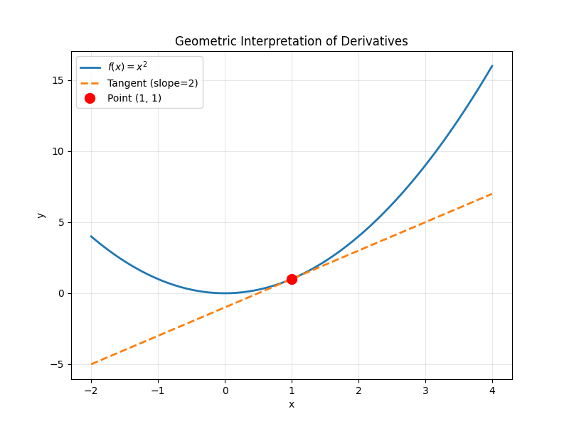

## What is a Derivative?

A derivative is a mathematical tool that measures the instantaneous rate of change of a function. Geometrically, it represents the slope of the tangent line to a curve.

### Definition Using Limits

The derivative of a function $f(x)$ at point $x = a$ is:

$$f'(a) = \lim_{h \to 0} \frac{f(a+h) - f(a)}{h}$$

This is called the **limit definition of the derivative**.

### Alternative Notations

Different notations are used for derivatives:

- $f'(x)$ (Lagrange notation)
- $\frac{df}{dx}$ (Leibniz notation)
- $\dot{f}$ (Newton notation - physics)
- $D_x f$ (Differential operator)

## Geometric Interpretation

The derivative represents the **slope of the tangent line** to the function's graph.

### Visualization

Let's visualize the derivative of $f(x) = x^2$ at point $x = 1$:



The graph shows:
- The **parabola** $f(x) = x^2$ (blue curve)
- The **tangent line** at point $(1, 1)$ with slope $f'(1) = 2$ (orange dashed line)
- The **point of tangency** marked in red

### Python Code

Here's the code used to generate the visualization:

```python
import numpy as np
import matplotlib.pyplot as plt

# f(x) = x^2 function
x = np.linspace(-2, 4, 100)
f = x**2

# Derivative at x=1: f'(1) = 2
x0 = 1
y0 = x0**2
slope = 2 * x0  # f'(x) = 2x

# Tangent line: y - y0 = m(x - x0)
tangent = slope * (x - x0) + y0

plt.figure(figsize=(8, 6))
plt.plot(x, f, label='$f(x) = x^2$', linewidth=2)
plt.plot(x, tangent, '--', label=f'Tangent (slope={slope})', linewidth=2)
plt.plot(x0, y0, 'ro', markersize=10, label=f'Point ({x0}, {y0})')
plt.grid(True, alpha=0.3)
plt.legend()
plt.xlabel('x')
plt.ylabel('y')
plt.title('Geometric Interpretation of Derivatives')
plt.savefig('derivative-graph.png', dpi=300, bbox_inches='tight')
plt.show()
```

## Basic Differentiation Rules

### Power Rule

For $f(x) = x^n$:

$$f'(x) = nx^{n-1}$$

**Examples:**
- $f(x) = x^2 \Rightarrow f'(x) = 2x$
- $f(x) = x^3 \Rightarrow f'(x) = 3x^2$
- $f(x) = \sqrt{x} = x^{1/2} \Rightarrow f'(x) = \frac{1}{2}x^{-1/2} = \frac{1}{2\sqrt{x}}$

### Constant Rule

If $c$ is a constant:

$$\frac{d}{dx}(c) = 0$$

### Constant Multiple Rule

$$\frac{d}{dx}[cf(x)] = c \cdot f'(x)$$

### Sum/Difference Rule

$$\frac{d}{dx}[f(x) \pm g(x)] = f'(x) \pm g'(x)$$

## Common Derivatives

| Function | Derivative |
|----------|-----------|
| $x^n$ | $nx^{n-1}$ |
| $e^x$ | $e^x$ |
| $\ln(x)$ | $\frac{1}{x}$ |
| $\sin(x)$ | $\cos(x)$ |
| $\cos(x)$ | $-\sin(x)$ |
| $\tan(x)$ | $\sec^2(x)$ |

## Practice Problems

1. Find $f'(x)$ if $f(x) = 3x^4 - 2x^2 + 5x - 1$

2. Calculate the derivative of $g(x) = \frac{1}{x^2}$

3. Find the slope of the tangent line to $y = x^3$ at $x = 2$

## Next Steps

In the next lesson, we'll explore:
- Product Rule
- Quotient Rule
- Chain Rule
- Applications of derivatives
